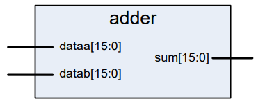
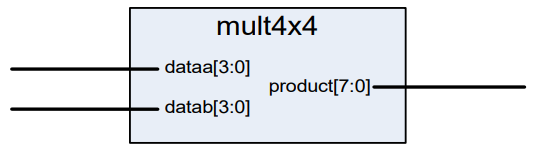

# Lab 1
Lab 1 will consist of two parts, A and B, which will have us implement a 16-bit adder and a 4x4 multiplier, respectively.

## Lab 1a

16-bit adder

The objectives of lab 1a are to:
- Build a 16-bit adder using the '+' operator.
- Practice coding ENTITY-ARCHITECTURE structure.

With this, we will be writing the vhdl file to implement this, and using a RTL simulation in ModelSim to test the functionality.

## Lab 2a

4x4 Multiplier

The objectives of lab 1b are to:
- Build a 4x4 multiplier using the '*' operator.
- Synthesize and verify its operation.

