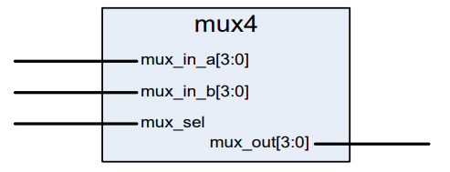
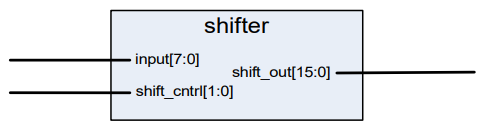

# Lab 2
Lab 2 will introduce use to making multiplexer blocks in VHDL using IF-THEN sequential statements.

## Lab 2a

2:1 multiplexer

The objectives of lab 2a are:
- Code a 4-bit 2:1 multiplexer block in VHDL using the IF-THEN sequential statement.
- Simulated the VHDL code in ModelSim to verify correct functionality.

## Lab 2b

8-bit to 16-bit left shifter

The objectives are lab 2b are:
- Code a 8-bit to 16-bit left shifter block using the IF-THEN sequential statement.
- Simulated the VHDL code in ModelSim to verify correct functionality.
