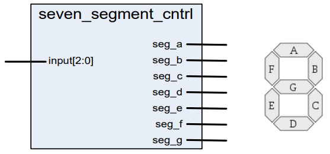
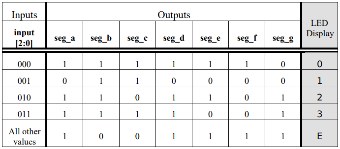

# Lab 3
In lab 3, the objectives are:
- Build a 7-segment LED display controller using the CASE statement.
- Synthesize and verify its operation.

Seven Segment Control

The input to the seven segment will a 3-bit data input that will be used to display the current state. It will follow this behavior:

This will utilize an explicit PROCESS and CASE sequential statement to accomplish the task.