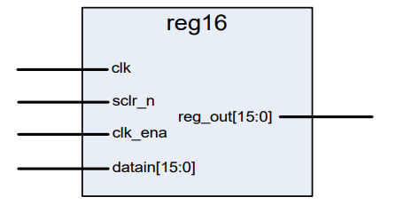
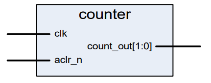

# Lab 4
Lab 4 will have two sections, one dealing with a synchronous control and another dealing with asynchronous control.

## Lab 4a
The objectives for Lab 4a are:
- Build a 16-bit register with synchronous control.
- Synthesize and verify its operation.

16-bit register

The 16-bit register with synchronous control will utilize a sequential PROCESS, and exhibit the following behavior:
- All transactions occur on the rising edge of a **clk**.
- On a rising edge clock, check if **clk_ena** is <ins>high</ins>
- If **clk_ena** is <ins>high</ins>, check if **sclr_n** is <ins>low</ins>. If so, then clear the register outputs.
- If **clk_ena** is <ins>high</ins> and **sclr_n** is <ins>not low</ins>, then the register outputs are equal to the register inputs.
- If **clk_ena** is low, do nothing.

# Lab 4b
The objectives for Lab 4b are:
- Build a 2-bit counter with asynchronous control.
- Synthesize and verify its operation.

2-bit Counter

The 2-bit counter with asynchronous control will utilize a sequential PROCESS, and exhibit the following behavior.
- The output of the counter goes to 00 immediately when **aclr_n** is <ins>low</ins>.
- If **aclr_n** is <ins>not low</ins>, then the output of the counter increments by 1 on every rising edge of **clk**.

