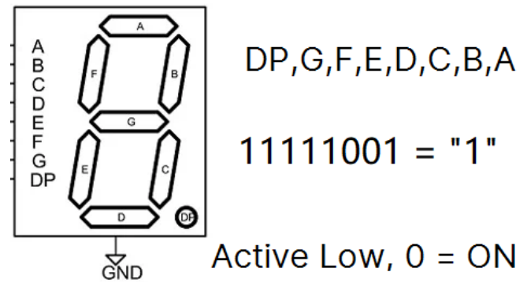
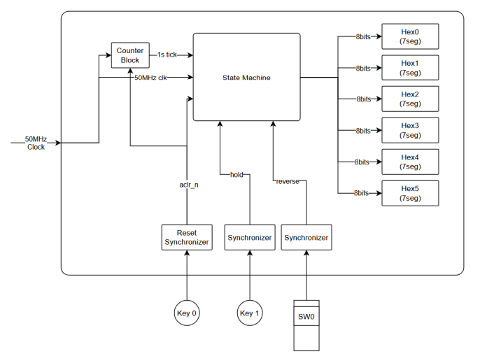

# Lab 6 - Sliding Sign
This lab will require the implementation of our own FSM (Finite State Machine). We will be using registers to hold the states of the FSM, a process for the next state logic.

We will control what is display 7 segment displays (HEX5, 4, 3, 2, 1, 0) that will update every second. 

>Seven Segment Display

Design Requirements
1) Start by displaying "EE457" on the 7 segment displays using HEX5 to HEX1, then every second shift right, left, or stop depending on the keys pressed.
2) HEX0 will display the numeric representation of the current state of the FSM.
3) Use KEY(0) as a asynchronous reset when pressed.
4) When reset, the FSM will reset to 0, and display "EE4570". This is the state machine resetting to 0 state.
5) The "EE457" will slide right every second, as it slides right, the upper HEX display will be blank. (For clarity, "b" will be used as blank).
    1) Starting the display will be EE4570
    2) 1 second later the display will be bEE451
    3) 1 second later the display will be bbEE42
    4) 1 second later the display will be bbbEE3
    5) 1 second later the display will be bbbbE4
    6) 1 second later the display will be bbbbb5
    7) 1 second later the display will be 7bbbb6
    8) 1 second later the display will be 57bbb7
    9) 1 second later the display will be 457bb8
    10) 1 second later the display will be E457b9
    11) 1 second later the display will be EE4570 - back to reset state

    The design will continue to shift until reversed, halted, or reset.

6) SW(0) will control the direction of the shift. When SW(0) is up, EE457 will shift left. When SW(0) is down, EE457 will shift right.

7) KEY(1) will halt the shifting when pressed. When released, the dispaly will continue to shift in whatever direction on SW(0).

8) KEY(1) and SW(0) need to have a 2 register synchronizer that is clocked with MAX10_CLK1_50 prior to utilizing the signals.

The suggested block diagram for this project:

>Suggested Block Diagram
