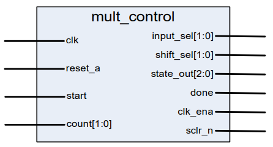
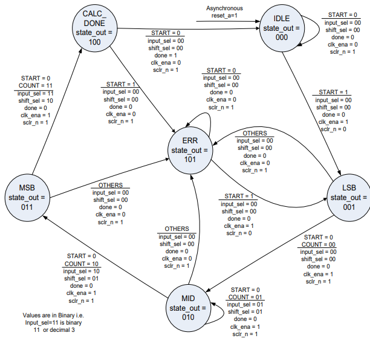

# Lab 5
Lab 5 will have two parts: one to create a state machine implementation, and then another to complete the component declarations and component port maps in our top-level implementation.

## Lab 5a
With all the components necessary to build the 8x8 multiplier, we need the final component: the controlling state machine. 

Multiplier Control

The state machine will manage all the operations that occur witin the 8x8 multiplier. This will occur in 6 states:
- idle
- lsb
- mid
- msb
- calc_done
- err

This state machine diagram shows more definition of the behavior that will be implemented:

Multiplier State Machine

# Lab 5b
This lab will finally wrap everything together in mult8x8 with all the component declarations and component port maps to implement the design. The objectives are:
- Complete the implementation of the 8x8 multiplier using instantiations.
- Synthesize and simulate to verify its operation.
